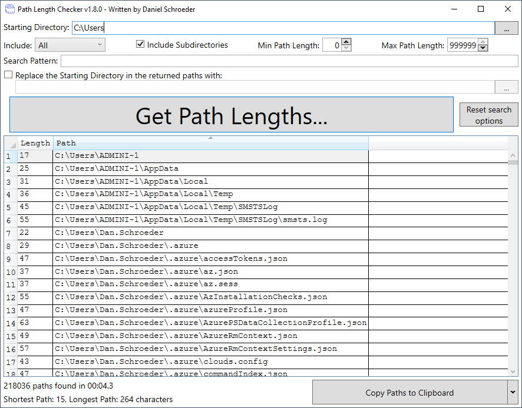

# Path Length Checker Description

Path Length Checker is a stand-alone app that allows you to specify a root (i.e. starting) directory, and it gives you back a list of all paths (i.e. files and directories) in that root directory and their lengths.
It includes features such as pattern matching and min/max length constraints, as well as the ability to specify a string that should replace the root directory in the results brought back, allowing you to quickly see path lengths if you were to move the files/folders to another location.

Download it from [the Releases page](https://github.com/deadlydog/PathLengthChecker/releases).

## Running via the GUI (Graphical User Interface)

To run the Path Length Checker using the GUI, run the `PathLengthCheckerGUI.exe`.

Once the app is open, simply provide the `Starting Directory` you want it to search and press the large `Get Path Lengths...` button.

You can also drag-and-drop a directory from File Explorer onto the `PathLengthCheckerGUI.exe` file to have it open up the application and search the directory automatically.

## Running via the Command Line

The `PathLengthChecker.exe` is the command-line alternative to the GUI. Simply run it without any parameters to see what parameters you can pass to it.

`PathLengthCheckerGUI.exe` also supports the same command-line parameter syntax. Additionally, specifying the target directory alone as the only argument is supported and will begin a search on the supplied path using defaults. This is useful for launching the GUI application from other programs, such as a Windows Explorer context menu action.

## Search Pattern

The `Search Pattern` parameter is used to match against specific file/directory names.
It is not case sensitive, and it supports the wildcards (`*`) for zero or more characters, and (`?`) for zero or one character.

Examples:

- `test.txt` matches only files named "test.txt".
- `test` matches any directory named "test", as well as any files named "test" that do not have an extension.
- `test*` matches any file or directory whose name begins with "test".
- `*txt` matches any files with a ".txt" extension, as well as any directory whose name ends in "txt".
- `*test*` matches any file or directory that contains "test" anywhere in the name or extension.

For more information on the search pattern syntax, see [the official Microsoft documentation](https://docs.microsoft.com/en-us/dotnet/api/system.io.directory.enumeratefilesystementries?view=net-5.0#System_IO_Directory_EnumerateFileSystemEntries_System_String_System_String_).

## Running via PowerShell

If you are looking for a PowerShell equivalent of this tool, you can use [this PowerShell script](tools/GetPathLengths.ps1) that offers similar functionality.

## Changelog

See what's changed in the application over time by viewing [the changelog](Changelog.md).

## Donate

Buy my dogs a new chew toy for providing this application open source and for free :)

